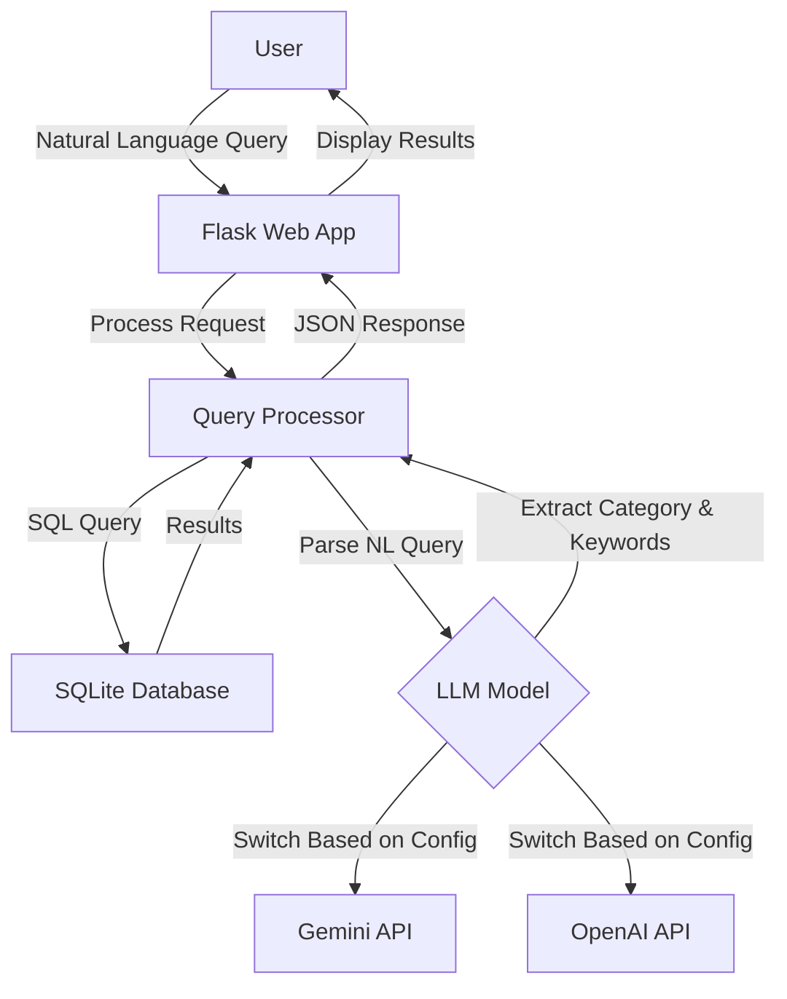

# BBC News Natural Language Query API

A lightweight natural language news query tool that combines a BBC news corpus with AI models (Google Gemini or OpenAI ChatGPT) to enable semantic search through news articles.

## Key Features

- 📰 Access BBC News article data using SQLite database
- 🔍 Efficient query caching mechanism to improve query speed
- 💬 Support for natural language query processing (using Gemini AI model)
- 🗄️ Concise, modular code structure
- 🚀 Lightweight design, easy to extend
- 🌐 Provides web interface for intuitive querying

## Dataset Information

This project uses the BBC News Dataset, which includes news articles in five main categories:
- **business**: Business news
- **entertainment**: Entertainment news
- **politics**: Political news
- **sport**: Sports news
- **tech**: Technology news

Data source: `https://huggingface.co/datasets/hf-internal/bbc-text/resolve/main/bbc-text.csv`

## 🔍 Quick Demo – Keyword‑Only Version (Baseline before LangChain)

The current implementation shows how far we can go **without** multi‑step
retrieval or an agent.  
It does exactly one thing:

1. **LLM extracts one keyword** from the user's natural‑language query  
2. **SQL `LIKE`** searches the BBC News corpus for that keyword  
3. Returns the first 10 matches, showing each article's *category* tag and
   the first few characters of its content

### How to run

```bash
# one‑time: convert CSV to SQLite  (skip if already done)
python scripts/csv_to_sqlite.py

# launch server
python app.py
```

Open http://localhost:5000, type a query, press Send.

#### Example queries

| Input | LLM‑extracted keyword  |
|-------|----------------------|
| Show me sports articles about football | football |
| tech news about Apple | apple |
| articles about foods | food (plural → singular) |
| latest news | (no keyword) → shows latest 10 articles |

When no article contains the keyword, you'll see:
⚠️ No news found.

## Project Structure

```
bbc-news-api/
├── app.py              # Flask application entry point
├── db.py               # Database connection and query handling
├── gemini_model.py     # Google Gemini API integration
├── chatgpt_model.py    # OpenAI ChatGPT integration
├── requirements.txt    # Project dependencies
├── .env                # Environment variables (API keys)
├── template.env        # Template for environment variables
├── README.md           # English documentation
├── README_ZH.md        # Chinese documentation
│
├── scripts/            
│   └── csv_to_sqlite.py  # Converts CSV dataset to SQLite
│
├── static/            
│   └── js/
│       └── main.js      # Frontend JavaScript
│
├── templates/         
│   └── index.html      # Main web interface
│
└── data/              
    ├── bbc-news.csv    # Original CSV dataset
    └── bbc_news.sqlite # SQLite database
```

## System Architecture



## Setup and Running

### Prerequisites
- Python 3.8+
- API key for Google Gemini or OpenAI (depending on which LLM you want to use)

### Installation

1. Clone the repository:
   ```bash
   git clone https://github.com/yourusername/bbc-news-api.git
   cd bbc-news-api
   ```

2. Create and activate a virtual environment:
   ```bash
   python -m venv venv
   source venv/bin/activate  # On Windows: venv\Scripts\activate
   ```

3. Install dependencies:
   ```bash
   pip install -r requirements.txt
   ```

4. Set up environment variables:
   ```bash
   cp template.env .env
   # Edit .env and add your API key(s)
   ```

5. Prepare the data:
   ```bash
   # Ensure bbc-news.csv is in the data/ folder
   python scripts/csv_to_sqlite.py
   ```

6. Run the application:
   ```bash
   python app.py
   ```

The application will be available at http://localhost:5000

## API Endpoints

### `/query` (POST)
Process a natural language query using the configured LLM.

**Request:**
```json
{
  "query": "Show me tech news about Apple"
}
```

**Response:**
```json
{
  "query": "Show me tech news about Apple",
  "parsed": {
    "category": "tech",
    "keyword": "Apple"
  },
  "results": [
    {
      "category": "tech",
      "text": "...[article content]..."
    },
    ...
  ]
}
```

### `/news` (GET)
Retrieve news articles with optional filtering.

**Parameters:**
- `category`: Filter by news category (business, entertainment, politics, sport, tech)
- `keyword`: Filter by keyword in text
- `page`: Page number (default: 1)
- `limit`: Results per page (default: 20)

**Response:**
```json
{
  "page": 1,
  "limit": 20,
  "total_pages": 10,
  "total": 200,
  "data": [
    {
      "category": "tech",
      "text": "...[article content]..."
    },
    ...
  ]
}
```

### `/search` (GET)
Simple keyword search in the news database.

**Parameters:**
- `q`: Search query
- `page`: Page number (default: 1)
- `limit`: Results per page (default: 20)

**Response:**
Same format as `/news` endpoint

### `/system_status` (GET)
Check system status and database availability.

**Response:**
```json
{
  "db_exists": true,
  "time": 1618123456.789
}
```

## LLM Integration

The application can be configured to use either Google's Gemini or OpenAI's models by setting the `AI_MODEL_TYPE` environment variable in the `.env` file:

```
AI_MODEL_TYPE=GEMINI  # or OPENAI
GEMINI_API_KEY=your_api_key_here
```

## Example Queries

- "Find tech news about mobile phones"
- "Show me sports articles about football"
- "What entertainment news mentions movies?"
- "Find business news from 2021"
- "Show me political news about elections"


我只建議做幾個「小修補 + 健壯化」就更穩了：

把 childOrigin 抽成常量並只算一次
現在在多處 new URL(...).origin，抽出 const CHILD_ORIGIN = useMemo(() => new URL(minionAssistantUIApplicationLink).origin, [minionAssistantUIApplicationLink])，避免拼寫錯或未來改 URL 時不一致。

token 近效判定時的 fallback
parseJwt 失敗或沒有 exp 時你現在 return true（視為快過期），但 sendTokenToIframe() 仍然只是再送一次舊 token。建議：

如果 !exp 或解析失敗 → 直接「當作需要刷新」，去呼叫你們 Terra 端的取 token 流程（若目前只能 authServices.getUser()，至少重新讀一次；若之後接上 /exchange-for-minion，在這裡打）。

同時把「收到子頁 token:request」時也走同一個取 token 函數，確保回的永遠是最新。

前景/可見性喚醒再推一次
瀏覽器掛背景久了計時器可能被 throttle。加上 visibilitychange/focus 事件：頁面回前景或 iframe 面板變可見時，立即 sendTokenToIframe()。

負載節流
加一個 2–3 秒的節流避免極端情況下 spam postMessage（例如主題在父頁被快速切換時或 token:request 短時間連發）。

鏈路日誌（開發期）
現在你有 console.warn / console.log 很好；再加一個 console.debug('[minion-panel] postMessage auth:token exp=', exp)，協助後續驗證 exp 與續期時點。

iframe allow（可選）
若你們有複製/貼上需求，可在 iframe 加 allow="clipboard-read; clipboard-write"（純前端，安全上 OK）。

邏輯順序
useEffect（初次送 token 與每 60 秒巡檢）依賴 iframeLoaded 沒問題；保留清除 interval 的 return 已有。

主題同步
prevThemeRef 已做去抖，OK。若未來主題不只 dark/light，可把 payload 擴成 {theme, version}，但現在不必。

如果你想保險一點，這 3 條再補上就完美：

在處理 token:request 前，先判定是否距離過期 < 5 分鐘或解析不到 exp → 走「刷新/重取」路徑，再推送。

在 window.addEventListener('focus', …) 與 document.addEventListener('visibilitychange', …) 裡再推一次 token。

抽出 async function pushFreshToken()：內含「重新取得 → postMessage」的通用流程，供定時巡檢、token:request、前景喚醒三處共用，避免分叉實作。


Prompt 2 — 給 Minion Assistant UI Copilot（Child 端）

你負責 Minion Assistant UI（被 Terra 以 iframe 載入）。請在不依賴父專案內部實作的情況下完成以下工作：

你要做的事

不再從 URL 讀取 token

移除讀取 window.location.search 中 token 的邏輯。

保留 UI 級別的參數讀取（如主題索引 / 使用者名 / geospatialViewer），但 token 必須改由 postMessage 接收。

建立可更新的 token 儲存與訂閱機制

準備一個簡單的 tokenStore（記憶體內）。

能夠：設定 token、取得目前 token、在 token 變更時通知訂閱者（API 客戶端、WS 客戶端等）。

初始化 postMessage 橋接

監聽 window.message；當收到 {"type":"auth:token"} 時更新 tokenStore。

啟動後若 3 秒內尚未收到 token，向父頁送出 {"type":"token:request","reason":"startup"}。

收到 {"type":"ui:theme"} 時，立即切換 dark/light（不重載頁面）。

嚴格驗證 event.origin 是否為 Terra 的網域；不符就忽略。

API 與 WebSocket 客戶端支援「熱更新 token」

API：每次請求都從 tokenStore 讀取最新 token 設定 Authorization header；或若使用 axios，建立單例並在 token 變更時更新預設 header。

WebSocket：

若現有服務支援「動態更新認證」，在 token 變更時呼叫該方法；

若不支援，請實作「平滑重連」：先用新 token 建立新連線，開通後再關閉舊連線，避免對話中斷。

401/過期自救流程

當 API 或 WS 收到 401 / 440 等認證錯誤時：

先向父頁送出 {"type":"token:request","reason":"401"}；

等待短暫時間後自動重試一次（使用更新後的 token）。

若仍失敗，可顯示友善提示，允許使用者重試。

授權狀態

以是否持有有效 token（由 tokenStore 控制）來決定是否顯示「未授權」提示；

若你們歷史上有寫入 sessionStorage 的相容需求，可以在 token 更新時同步寫入，但邏輯以 tokenStore 為主。

驗收標準

不重載 iframe 的情況下，能在收到父頁新 token 後，API 與 WS 都改用新 token。

長時間閒置後仍能正常對話（在父頁推送或子頁請求後恢復）。

模擬 401 時，子頁會向父頁請求新 token，並在短時間內自動恢復一次。

主題切換能即時生效。

網址與網路紀錄中不再出現 token；postMessage 的 origin 驗證正確。

有文件（或 PR 描述）簡述事件協議與本端行為。
