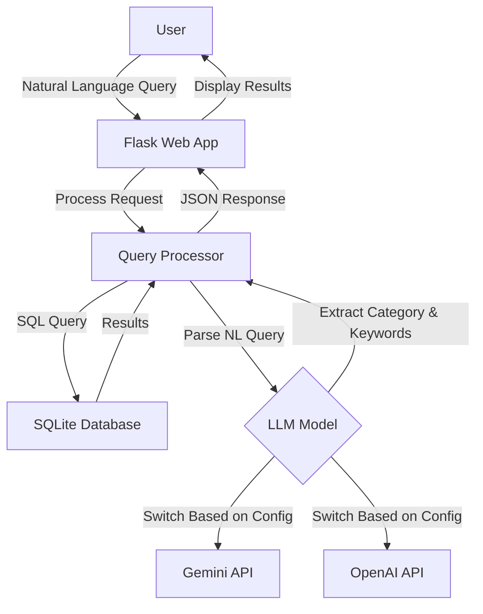

# BBC News Natural Language Query API

A lightweight natural language news query tool that combines a BBC news corpus with AI models (Google Gemini or OpenAI ChatGPT) to enable semantic search through news articles.

## Key Features

- 📰 Access BBC News article data using SQLite database
- 🔍 Efficient query caching mechanism to improve query speed
- 💬 Support for natural language query processing (using Gemini AI model)
- 🗄️ Concise, modular code structure
- 🚀 Lightweight design, easy to extend
- 🌐 Provides web interface for intuitive querying

## Dataset Information

This project uses the BBC News Dataset, which includes news articles in five main categories:
- **business**: Business news
- **entertainment**: Entertainment news
- **politics**: Political news
- **sport**: Sports news
- **tech**: Technology news

Data source: `https://huggingface.co/datasets/hf-internal/bbc-text/resolve/main/bbc-text.csv`

## 🔍 Quick Demo – Keyword‑Only Version (Baseline before LangChain)

The current implementation shows how far we can go **without** multi‑step
retrieval or an agent.  
It does exactly one thing:

1. **LLM extracts one keyword** from the user's natural‑language query  
2. **SQL `LIKE`** searches the BBC News corpus for that keyword  
3. Returns the first 10 matches, showing each article's *category* tag and
   the first few characters of its content

### How to run

```bash
# one‑time: convert CSV to SQLite  (skip if already done)
python scripts/csv_to_sqlite.py

# launch server
python app.py
```

Open http://localhost:5000, type a query, press Send.

#### Example queries

| Input | LLM‑extracted keyword  |
|-------|----------------------|
| Show me sports articles about football | football |
| tech news about Apple | apple |
| articles about foods | food (plural → singular) |
| latest news | (no keyword) → shows latest 10 articles |

When no article contains the keyword, you'll see:
⚠️ No news found.

## Project Structure

```
bbc-news-api/
├── app.py              # Flask application entry point
├── db.py               # Database connection and query handling
├── gemini_model.py     # Google Gemini API integration
├── chatgpt_model.py    # OpenAI ChatGPT integration
├── requirements.txt    # Project dependencies
├── .env                # Environment variables (API keys)
├── template.env        # Template for environment variables
├── README.md           # English documentation
├── README_ZH.md        # Chinese documentation
│
├── scripts/            
│   └── csv_to_sqlite.py  # Converts CSV dataset to SQLite
│
├── static/            
│   └── js/
│       └── main.js      # Frontend JavaScript
│
├── templates/         
│   └── index.html      # Main web interface
│
└── data/              
    ├── bbc-news.csv    # Original CSV dataset
    └── bbc_news.sqlite # SQLite database
```

## System Architecture



## Setup and Running

### Prerequisites
- Python 3.8+
- API key for Google Gemini or OpenAI (depending on which LLM you want to use)

### Installation

1. Clone the repository:
   ```bash
   git clone https://github.com/yourusername/bbc-news-api.git
   cd bbc-news-api
   ```

2. Create and activate a virtual environment:
   ```bash
   python -m venv venv
   source venv/bin/activate  # On Windows: venv\Scripts\activate
   ```

3. Install dependencies:
   ```bash
   pip install -r requirements.txt
   ```

4. Set up environment variables:
   ```bash
   cp template.env .env
   # Edit .env and add your API key(s)
   ```

5. Prepare the data:
   ```bash
   # Ensure bbc-news.csv is in the data/ folder
   python scripts/csv_to_sqlite.py
   ```

6. Run the application:
   ```bash
   python app.py
   ```

The application will be available at http://localhost:5000

## API Endpoints

### `/query` (POST)
Process a natural language query using the configured LLM.

**Request:**
```json
{
  "query": "Show me tech news about Apple"
}
```

**Response:**
```json
{
  "query": "Show me tech news about Apple",
  "parsed": {
    "category": "tech",
    "keyword": "Apple"
  },
  "results": [
    {
      "category": "tech",
      "text": "...[article content]..."
    },
    ...
  ]
}
```

### `/news` (GET)
Retrieve news articles with optional filtering.

**Parameters:**
- `category`: Filter by news category (business, entertainment, politics, sport, tech)
- `keyword`: Filter by keyword in text
- `page`: Page number (default: 1)
- `limit`: Results per page (default: 20)

**Response:**
```json
{
  "page": 1,
  "limit": 20,
  "total_pages": 10,
  "total": 200,
  "data": [
    {
      "category": "tech",
      "text": "...[article content]..."
    },
    ...
  ]
}
```

### `/search` (GET)
Simple keyword search in the news database.

**Parameters:**
- `q`: Search query
- `page`: Page number (default: 1)
- `limit`: Results per page (default: 20)

**Response:**
Same format as `/news` endpoint

### `/system_status` (GET)
Check system status and database availability.

**Response:**
```json
{
  "db_exists": true,
  "time": 1618123456.789
}
```

## LLM Integration

The application can be configured to use either Google's Gemini or OpenAI's models by setting the `AI_MODEL_TYPE` environment variable in the `.env` file:

```
AI_MODEL_TYPE=GEMINI  # or OPENAI
GEMINI_API_KEY=your_api_key_here
```

## Example Queries

- "Find tech news about mobile phones"
- "Show me sports articles about football"
- "What entertainment news mentions movies?"
- "Find business news from 2021"
- "Show me political news about elections"


_______________


🧠 SYSTEM / DEV PROMPT — “Build Assistant Agent” Toolbar & Wizard Integration

Context:
We’re working inside the Newton team’s Minion Assistant UI, located under
riskmanagementtool-web/src/components/gptComponents.
This React-based chat UI is currently embedded within the main Risk Management Tool interface (the drawer panel on the right).

Yesterday, we implemented a collapsible Agentic Journey panel using React Flow.
That feature is now deprioritized, but we still want to keep a small icon for it — mainly as a decorative or expandable toggle — while focusing our main effort on a new “Build Assistant Agent” workflow.

🎯 GOAL

Implement a new top toolbar section in the Minion Assistant panel that supports:

Agent Selection Dropdown — to switch between existing mock agents.

“+ New Agent” Button — launches a multi-step wizard modal for building a new agent.

Compact Agentic Journey Icon — retained from the previous feature, placed as a small icon button instead of a full toggle.

🧩 FUNCTIONAL REQUIREMENTS
Toolbar Layout

Located in the same row as the “Debug Mode” and “Clear Chat” controls.
Structure example:

[ Debug Mode ⏻ ]   [🕸 Agentic Journey icon]   |   Agent: [▼ Minion Assistant]   [+ New Agent]


Agentic Journey icon: small (16–20px), tooltip “View Agentic Journey (Mock)”.
Clicking it may toggle a placeholder panel or console log for now.

Agent Selector: dropdown showing mock agent profiles.

New Agent button: opens the wizard modal.

Mock Agent List (local state)

Use a simple local state array like:

const [agents, setAgents] = useState([
  { id: '1', name: 'Minion Assistant', model: 'GPT-4.1', persona: 'Exposure dataset Q&A bot' },
  { id: '2', name: 'Data Auditor', model: 'Claude Sonnet 4', persona: 'Performs data validation tasks' },
]);


Selecting an agent updates the chat header:

Hi [User], I'm [Agent.name].

Wizard Modal (multi-step flow)

Triggered by “+ New Agent”.

Use a simple 4-step mock wizard with “Next” and “Previous” navigation.

Step 1: Define Agent Persona

Inputs:

Agent Name (text)

Persona / Instructions (textarea)

Step 2: Select Sources & Tools

Checkboxes (mock only):

Exposure Dataset

Spectrum API

Python Tool

Step 3: Choose Model

Radio buttons or cards:

GPT-4.1 — “Complex tasks, long docs”

Claude Sonnet 4 — “For coding and technical tasks”

o4-mini — “Reasoning with improved accuracy”

Step 4: Review & Finish

Show entered data summary

“Finish” button: adds new agent to dropdown, logs to console

State persists through steps (no backend yet).

Tech Notes

Modal component can be placed under gptComponents/AgentBuilder/AgentBuilderModal.tsx.

Toolbar logic can live in GPTHeader.tsx or wherever “Debug Mode” is currently implemented.

Style using existing MDBootstrap / dark theme classes to match Minion Assistant UI.

Keep all code modular and commented for future backend integration.

✅ ACCEPTANCE CRITERIA

New toolbar row visible above chat box.

Dropdown correctly lists and switches mock agents.

“+ New Agent” opens the 4-step wizard modal.

Completing wizard adds new agent to dropdown.

Compact Agentic Journey icon remains functional but minimal.

No layout regression to existing Chat UI.

🧭 DESIGN HINTS

Keep everything responsive; dropdown width around 200px is fine.

For wizard navigation, simple <Step x of 4> indicator at the top is enough.

Use transitions (e.g. fade between steps) if easy, otherwise static is fine.

Maintain dark theme and orange accent alignment with existing Minion Assistant branding.

💬 OPTIONAL (if you detect unused or legacy code)

If old Agentic Journey components are no longer used, wrap them under a React.lazy import or move them to a separate folder like legacy/AgenticJourney/ but do not delete yet.

Summary:
You are extending the existing Minion Assistant UI by replacing the full Agentic Journey toggle with a compact icon and introducing a new “Agent Builder” feature — a dropdown for selecting agents and a multi-step modal wizard for creating new ones, using mock data only for now.

