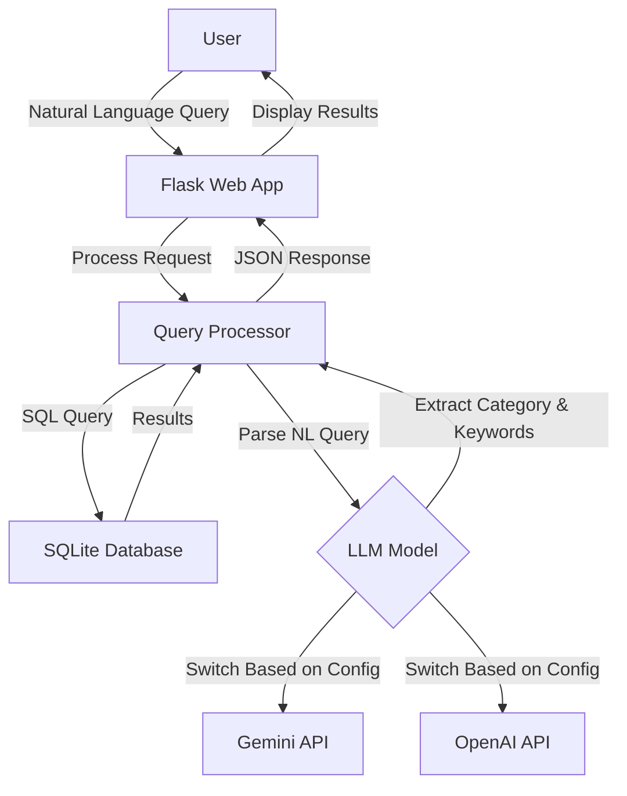

# BBC News Natural Language Query API

A lightweight natural language news query tool that combines a BBC news corpus with AI models (Google Gemini or OpenAI ChatGPT) to enable semantic search through news articles.

## Key Features

- 📰 Access BBC News article data using SQLite database
- 🔍 Efficient query caching mechanism to improve query speed
- 💬 Support for natural language query processing (using Gemini AI model)
- 🗄️ Concise, modular code structure
- 🚀 Lightweight design, easy to extend
- 🌐 Provides web interface for intuitive querying

## Dataset Information

This project uses the BBC News Dataset, which includes news articles in five main categories:
- **business**: Business news
- **entertainment**: Entertainment news
- **politics**: Political news
- **sport**: Sports news
- **tech**: Technology news

Data source: `https://huggingface.co/datasets/hf-internal/bbc-text/resolve/main/bbc-text.csv`

## 🔍 Quick Demo – Keyword‑Only Version (Baseline before LangChain)

The current implementation shows how far we can go **without** multi‑step
retrieval or an agent.  
It does exactly one thing:

1. **LLM extracts one keyword** from the user's natural‑language query  
2. **SQL `LIKE`** searches the BBC News corpus for that keyword  
3. Returns the first 10 matches, showing each article's *category* tag and
   the first few characters of its content

### How to run

```bash
# one‑time: convert CSV to SQLite  (skip if already done)
python scripts/csv_to_sqlite.py

# launch server
python app.py
```

Open http://localhost:5000, type a query, press Send.

#### Example queries

| Input | LLM‑extracted keyword  |
|-------|----------------------|
| Show me sports articles about football | football |
| tech news about Apple | apple |
| articles about foods | food (plural → singular) |
| latest news | (no keyword) → shows latest 10 articles |

When no article contains the keyword, you'll see:
⚠️ No news found.

## Project Structure

```
bbc-news-api/
├── app.py              # Flask application entry point
├── db.py               # Database connection and query handling
├── gemini_model.py     # Google Gemini API integration
├── chatgpt_model.py    # OpenAI ChatGPT integration
├── requirements.txt    # Project dependencies
├── .env                # Environment variables (API keys)
├── template.env        # Template for environment variables
├── README.md           # English documentation
├── README_ZH.md        # Chinese documentation
│
├── scripts/            
│   └── csv_to_sqlite.py  # Converts CSV dataset to SQLite
│
├── static/            
│   └── js/
│       └── main.js      # Frontend JavaScript
│
├── templates/         
│   └── index.html      # Main web interface
│
└── data/              
    ├── bbc-news.csv    # Original CSV dataset
    └── bbc_news.sqlite # SQLite database
```

## System Architecture



## Setup and Running

### Prerequisites
- Python 3.8+
- API key for Google Gemini or OpenAI (depending on which LLM you want to use)

### Installation

1. Clone the repository:
   ```bash
   git clone https://github.com/yourusername/bbc-news-api.git
   cd bbc-news-api
   ```

2. Create and activate a virtual environment:
   ```bash
   python -m venv venv
   source venv/bin/activate  # On Windows: venv\Scripts\activate
   ```

3. Install dependencies:
   ```bash
   pip install -r requirements.txt
   ```

4. Set up environment variables:
   ```bash
   cp template.env .env
   # Edit .env and add your API key(s)
   ```

5. Prepare the data:
   ```bash
   # Ensure bbc-news.csv is in the data/ folder
   python scripts/csv_to_sqlite.py
   ```

6. Run the application:
   ```bash
   python app.py
   ```

The application will be available at http://localhost:5000

## API Endpoints

### `/query` (POST)
Process a natural language query using the configured LLM.

**Request:**
```json
{
  "query": "Show me tech news about Apple"
}
```

**Response:**
```json
{
  "query": "Show me tech news about Apple",
  "parsed": {
    "category": "tech",
    "keyword": "Apple"
  },
  "results": [
    {
      "category": "tech",
      "text": "...[article content]..."
    },
    ...
  ]
}
```

### `/news` (GET)
Retrieve news articles with optional filtering.

**Parameters:**
- `category`: Filter by news category (business, entertainment, politics, sport, tech)
- `keyword`: Filter by keyword in text
- `page`: Page number (default: 1)
- `limit`: Results per page (default: 20)

**Response:**
```json
{
  "page": 1,
  "limit": 20,
  "total_pages": 10,
  "total": 200,
  "data": [
    {
      "category": "tech",
      "text": "...[article content]..."
    },
    ...
  ]
}
```

### `/search` (GET)
Simple keyword search in the news database.

**Parameters:**
- `q`: Search query
- `page`: Page number (default: 1)
- `limit`: Results per page (default: 20)

**Response:**
Same format as `/news` endpoint

### `/system_status` (GET)
Check system status and database availability.

**Response:**
```json
{
  "db_exists": true,
  "time": 1618123456.789
}
```

## LLM Integration

The application can be configured to use either Google's Gemini or OpenAI's models by setting the `AI_MODEL_TYPE` environment variable in the `.env` file:

```
AI_MODEL_TYPE=GEMINI  # or OPENAI
GEMINI_API_KEY=your_api_key_here
```

## Example Queries

- "Find tech news about mobile phones"
- "Show me sports articles about football"
- "What entertainment news mentions movies?"
- "Find business news from 2021"
- "Show me political news about elections"


_______________


Context & Goal

We’re adding an “Agentic Journey” visualization to the Minion Assistant UI inside Newton’s riskmanagementttool-web project.
The visualization should be a collapsible bottom panel embedded in the chat drawer, showing a React Flow graph of agents collaborating (mock data for now). Users can toggle it on/off with a new control placed between “Debug Mode” and “Clear Chat.”

This is Phase 1 (POC): UI only, with mock data and no backend. Phase 2 will wire a WebSocket event stream to update the graph live.

Where to work

Repo: riskmanagementttool-web

Focus folder: riskmanagementttool-web/src/components/gptComponents
(this folder hosts all Minion-Assistant-UI related components)

The chat drawer screen is where the new panel will appear.

Before coding, scan all components in gptComponents/ to understand current composition, state, styling, and how “Debug Mode” and “Clear Chat” are rendered (you will add a new control alongside them).

UX Requirements (Phase 1, POC)

Toggle control labeled “Agentic Journey” placed between “Debug Mode” and “Clear Chat.”

When toggled on, a collapsible bottom panel opens inside the chat view.

Panel width follows the chat drawer.

Height is adjustable with drag (or at least provide 3 presets: mini / medium / full).

The panel header shows “Agentic Journey (Mock)” and a collapse/close affordance.

Inside the panel, render a React Flow canvas with mock nodes/edges (see Mock Data below).

Keep perf light:

Lazy-load React Flow.

No expensive animations.

Dark/Light theme should match existing UI. If there’s a design system, reuse tokens.

Panel state (open/height) can be local state for now. Persisting across refresh is not required.

Non-Goals (Phase 1)

No WebSocket hookup yet.

No MAS SDK integration yet.

No exporting PNG/SVG, no auditing timelines.

Tech Decisions

React + TypeScript (match repo).

Add React Flow (reactflow) as a dependency. Use dynamic import for lazy loading.

Keep state local (React state or minimal Zustand if already used in gptComponents).

No CSS framework changes. Reuse existing button styles.

Tasks (Do in this order)

Dependency

Add reactflow to the project.

If code-splitting is used, lazy-import React Flow in the panel.

Discover & Place Toggle

Find the component that renders the chat header controls (where “Debug Mode” and “Clear Chat” live).

Insert a new button: “Agentic Journey” (outline/secondary style to match).

Clicking toggles showAgenticJourney.

Create Components

gptComponents/AgenticJourneyPanel/AgenticJourneyPanel.tsx

Props: { open: boolean; onClose: () => void; }

Renders: header (title + close), resizable container, lazy-loaded React Flow canvas.

gptComponents/AgenticJourneyPanel/mockData.ts

Expose mockNodes, mockEdges.

Collapsible/Resizable behavior

Start with a simple height state (min: 160px, default: 320px, max: 60vh).

Either:

use a small custom drag handle at the top edge, or

provide 3 preset heights via a small dropdown in the header.

Smooth open/close (CSS transition on height/opacity).

Integrate Panel into Chat Screen

In the chat container, render <AgenticJourneyPanel open={show} onClose={...} /> above the message input area (or just above the footer), so it doesn’t overlap the input.

When closed, remove from DOM (or keep minimal footprint).

Mock Data (Phase 1)

Use these node labels:

Agent: Data Retriever

Agent: Minion Assistant

Agent: Validator

Linear flow: Data Retriever → Minion Assistant → Validator

Give nodes stable id, positions, and simple styles that fit the theme.

Accessibility

Toggle button is keyboard focusable with ARIA aria-pressed.

Panel header has aria-label="Agentic Journey (Mock)" and an accessible close button.

Feature flag (optional but nice)

If the repo uses feature flags, gate this with FEATURE_AGENTIC_JOURNEY.

Mock Data (drop into mockData.ts)
import { Node, Edge } from 'reactflow';

export const mockNodes: Node[] = [
  { id: 'start', type: 'input', data: { label: 'start' }, position: { x: 40, y: 80 } },
  { id: 'agentA', data: { label: 'Agent: Data Retriever' }, position: { x: 200, y: 80 } },
  { id: 'agentB', data: { label: 'Agent: Minion Assistant' }, position: { x: 440, y: 80 } },
  { id: 'agentC', data: { label: 'Agent: Validator' }, position: { x: 720, y: 80 } },
  { id: 'end', type: 'output', data: { label: 'end' }, position: { x: 940, y: 80 } },
];

export const mockEdges: Edge[] = [
  { id: 'e1', source: 'start',  target: 'agentA' },
  { id: 'e2', source: 'agentA', target: 'agentB' },
  { id: 'e3', source: 'agentB', target: 'agentC' },
  { id: 'e4', source: 'agentC', target: 'end' },
];

Panel Skeleton (AgenticJourneyPanel.tsx)
import React, { Suspense, useMemo } from 'react';
const ReactFlow = React.lazy(() => import('reactflow'));
import 'reactflow/dist/style.css';
import { mockNodes, mockEdges } from './mockData';

type Props = { open: boolean; onClose: () => void };

export default function AgenticJourneyPanel({ open, onClose }: Props) {
  const [height, setHeight] = React.useState(320);
  const nodes = useMemo(() => mockNodes, []);
  const edges = useMemo(() => mockEdges, []);

  if (!open) return null;

  return (
    <div
      style={{
        position: 'relative',
        width: '100%',
        height,
        borderTop: '1px solid var(--border-color)',
        background: 'var(--panel-bg, #111)',
        transition: 'height 160ms ease',
      }}
      role="region"
      aria-label="Agentic Journey (Mock)"
    >
      {/* Header */}
      <div style={{
        display:'flex', alignItems:'center', justifyContent:'space-between',
        padding:'8px 12px', borderBottom:'1px solid var(--border-color)'
      }}>
        <div style={{fontWeight:600}}>Agentic Journey (Mock)</div>
        <div style={{ display:'flex', gap:8 }}>
          {/* Preset heights */}
          <select
            aria-label="Panel height"
            onChange={(e) => setHeight(Number(e.target.value))}
            defaultValue={height}
          >
            <option value={200}>Mini</option>
            <option value={320}>Medium</option>
            <option value={480}>Full</option>
          </select>
          <button onClick={onClose}>Close</button>
        </div>
      </div>

      {/* Canvas */}
      <div style={{ width:'100%', height: height - 40 }}>
        <Suspense fallback={<div style={{padding:12}}>Loading graph…</div>}>
          <ReactFlow nodes={nodes} edges={edges} fitView />
        </Suspense>
      </div>
    </div>
  );
}

Toggle Placement (example)

Wherever the chat header controls are rendered, add:

const [showJourney, setShowJourney] = React.useState(false);

// between Debug Mode and Clear Chat:
<button
  aria-pressed={showJourney}
  onClick={() => setShowJourney(v => !v)}
  title="Show Agentic Journey"
>
  Agentic Journey
</button>

// later inside the chat screen layout:
<AgenticJourneyPanel open={showJourney} onClose={() => setShowJourney(false)} />


(Use your project’s button components/styles instead of raw <button>; match spacing with neighboring controls.)

Acceptance Criteria (Phase 1)

A new Agentic Journey button appears between Debug Mode and Clear Chat.

Clicking it opens a bottom collapsible panel within the chat drawer.

The panel shows a React Flow graph with mock nodes/edges:

Agent: Data Retriever → Agent: Minion Assistant → Agent: Validator

Panel can be resized via preset heights and can be closed.

No regressions to chat behavior or layout.

No errors in console; React Flow is lazy-loaded.

Notes for Phase 2 (for later)

Define an AgentEvent schema and a normalizer to map events → nodes/edges.

Keep an append-only event log; update node status (running/success/error) and edge highlighting.

Consider a small legend and tooltips for agent/tool nodes.

That’s everything your agent needs to start a clean POC in the exact folder, with minimal risk and a clear path to real-time integration later.
