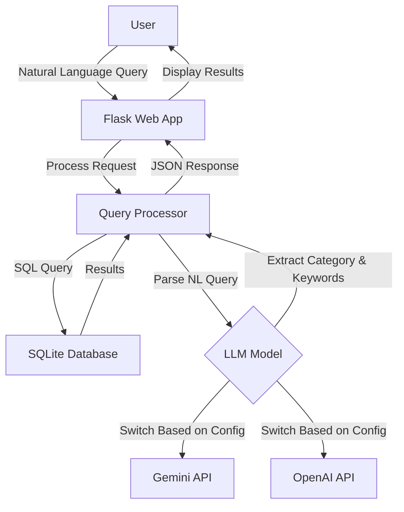

# BBC News Natural Language Query API

A lightweight natural language news query tool that combines a BBC news corpus with AI models (Google Gemini or OpenAI ChatGPT) to enable semantic search through news articles.

## Key Features

- 📰 Access BBC News article data using SQLite database
- 🔍 Efficient query caching mechanism to improve query speed
- 💬 Support for natural language query processing (using Gemini AI model)
- 🗄️ Concise, modular code structure
- 🚀 Lightweight design, easy to extend
- 🌐 Provides web interface for intuitive querying

## Dataset Information

This project uses the BBC News Dataset, which includes news articles in five main categories:
- **business**: Business news
- **entertainment**: Entertainment news
- **politics**: Political news
- **sport**: Sports news
- **tech**: Technology news

Data source: `https://huggingface.co/datasets/hf-internal/bbc-text/resolve/main/bbc-text.csv`

## 🔍 Quick Demo – Keyword‑Only Version (Baseline before LangChain)

The current implementation shows how far we can go **without** multi‑step
retrieval or an agent.  
It does exactly one thing:

1. **LLM extracts one keyword** from the user's natural‑language query  
2. **SQL `LIKE`** searches the BBC News corpus for that keyword  
3. Returns the first 10 matches, showing each article's *category* tag and
   the first few characters of its content

### How to run

```bash
# one‑time: convert CSV to SQLite  (skip if already done)
python scripts/csv_to_sqlite.py

# launch server
python app.py
```

Open http://localhost:5000, type a query, press Send.

#### Example queries

| Input | LLM‑extracted keyword  |
|-------|----------------------|
| Show me sports articles about football | football |
| tech news about Apple | apple |
| articles about foods | food (plural → singular) |
| latest news | (no keyword) → shows latest 10 articles |

When no article contains the keyword, you'll see:
⚠️ No news found.

## Project Structure

```
bbc-news-api/
├── app.py              # Flask application entry point
├── db.py               # Database connection and query handling
├── gemini_model.py     # Google Gemini API integration
├── chatgpt_model.py    # OpenAI ChatGPT integration
├── requirements.txt    # Project dependencies
├── .env                # Environment variables (API keys)
├── template.env        # Template for environment variables
├── README.md           # English documentation
├── README_ZH.md        # Chinese documentation
│
├── scripts/            
│   └── csv_to_sqlite.py  # Converts CSV dataset to SQLite
│
├── static/            
│   └── js/
│       └── main.js      # Frontend JavaScript
│
├── templates/         
│   └── index.html      # Main web interface
│
└── data/              
    ├── bbc-news.csv    # Original CSV dataset
    └── bbc_news.sqlite # SQLite database
```

## System Architecture



## Setup and Running

### Prerequisites
- Python 3.8+
- API key for Google Gemini or OpenAI (depending on which LLM you want to use)

### Installation

1. Clone the repository:
   ```bash
   git clone https://github.com/yourusername/bbc-news-api.git
   cd bbc-news-api
   ```

2. Create and activate a virtual environment:
   ```bash
   python -m venv venv
   source venv/bin/activate  # On Windows: venv\Scripts\activate
   ```

3. Install dependencies:
   ```bash
   pip install -r requirements.txt
   ```

4. Set up environment variables:
   ```bash
   cp template.env .env
   # Edit .env and add your API key(s)
   ```

5. Prepare the data:
   ```bash
   # Ensure bbc-news.csv is in the data/ folder
   python scripts/csv_to_sqlite.py
   ```

6. Run the application:
   ```bash
   python app.py
   ```

The application will be available at http://localhost:5000

## API Endpoints

### `/query` (POST)
Process a natural language query using the configured LLM.

**Request:**
```json
{
  "query": "Show me tech news about Apple"
}
```

**Response:**
```json
{
  "query": "Show me tech news about Apple",
  "parsed": {
    "category": "tech",
    "keyword": "Apple"
  },
  "results": [
    {
      "category": "tech",
      "text": "...[article content]..."
    },
    ...
  ]
}
```

### `/news` (GET)
Retrieve news articles with optional filtering.

**Parameters:**
- `category`: Filter by news category (business, entertainment, politics, sport, tech)
- `keyword`: Filter by keyword in text
- `page`: Page number (default: 1)
- `limit`: Results per page (default: 20)

**Response:**
```json
{
  "page": 1,
  "limit": 20,
  "total_pages": 10,
  "total": 200,
  "data": [
    {
      "category": "tech",
      "text": "...[article content]..."
    },
    ...
  ]
}
```

### `/search` (GET)
Simple keyword search in the news database.

**Parameters:**
- `q`: Search query
- `page`: Page number (default: 1)
- `limit`: Results per page (default: 20)

**Response:**
Same format as `/news` endpoint

### `/system_status` (GET)
Check system status and database availability.

**Response:**
```json
{
  "db_exists": true,
  "time": 1618123456.789
}
```

## LLM Integration

The application can be configured to use either Google's Gemini or OpenAI's models by setting the `AI_MODEL_TYPE` environment variable in the `.env` file:

```
AI_MODEL_TYPE=GEMINI  # or OPENAI
GEMINI_API_KEY=your_api_key_here
```

## Example Queries

- "Find tech news about mobile phones"
- "Show me sports articles about football"
- "What entertainment news mentions movies?"
- "Find business news from 2021"
- "Show me political news about elections"


  目標

在 不改動現有程式碼邏輯 的前提下，新增一組「前端 OIDC 靜默重登（silent renew）」能力，讓父端在 token 快到期（或測試模式）時，於背景重新取得 新的 access token，並推給 iframe（Minion UI）。

重要：現階段以「新增檔案／函式」方式實作；等驗證通過後再進行重構。

變更範圍

authServices.ts：新增工具與 silentRenew()，不改舊函式。

新增靜態頁：public/silent-oidc.html（或等效路徑，需同源提供）。


實作細節
1) 在 authServices.ts 新增下列內容（不動既有函式）

新增（private）小工具：buildAuthorizeUrl(opts?: { prompt?: string; redirectUri?: string; responseType?: string }): string

參數來源複用目前 authenticate()/loginUrl 組裝使用到的 IdConfig 欄位（issuer, authEndPoint, clientId, scope, resource, audienceUrl, 以及預設的 redirectUrl 等）。

預設 response_type = 'id_token token'；加入 state 與 nonce（可用 timestamp）。

若 opts.prompt 存在，請加上 &prompt=...；若 opts.redirectUri 存在，覆蓋預設的 redirect_uri。

新增（public）方法：

async function silentRenew(timeoutMs = 10000): Promise<{ ok: boolean; token?: string; exp?: number; reason?: string }>


行為：

以 prompt=none、redirect_uri = location.origin + '/silent-oidc.html' 呼叫 buildAuthorizeUrl()，得到 authorize URL。

建立隱藏 iframe載入該 URL（width/height=0、visibility:hidden、border:0）。

監聽 window.message，只接受 同源(e.origin === location.origin) 的 { type:'auth:silent-done', ok, token, exp }。

成功時：以相容現有結構寫回 sessionStorage.setItem('currentuser', JSON.stringify({ access_token: token }))，並回傳 { ok:true, token, exp }。

逾時 / error 以 { ok:false, reason } resolve；注意清理 event listener 與 iframe。

補一個小工具 parseJwtExp(token): number | undefined（取 payload.exp，失敗 return undefined），供 fallback 使用。

請僅新增上述方法，不移除或修改原有 authenticate()/getUser() 等函式。

2) 新增 public/silent-oidc.html（同源提供）

載入即執行腳本：從 location.hash 或 location.search 解析 access_token / id_token（不同 IdP 可能放不同欄位；以 access_token 優先）。

嘗試解析 JWT payload 的 exp（可選）；失敗可省略。

呼叫：

window.parent.postMessage(
  { type: 'auth:silent-done', ok: true, token: accessTokenOrIdToken, exp },
  window.location.origin
);


若失敗則 { ok:false, error: '...' }。

無 UI、無樣式；成功與否皆不導頁。


