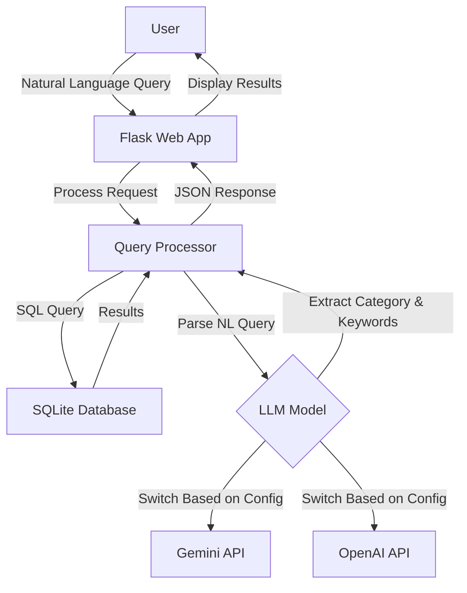

# BBC News Natural Language Query API

A lightweight natural language news query tool that combines a BBC news corpus with AI models (Google Gemini or OpenAI ChatGPT) to enable semantic search through news articles.

## Key Features

- 📰 Access BBC News article data using SQLite database
- 🔍 Efficient query caching mechanism to improve query speed
- 💬 Support for natural language query processing (using Gemini AI model)
- 🗄️ Concise, modular code structure
- 🚀 Lightweight design, easy to extend
- 🌐 Provides web interface for intuitive querying

## Dataset Information

This project uses the BBC News Dataset, which includes news articles in five main categories:
- **business**: Business news
- **entertainment**: Entertainment news
- **politics**: Political news
- **sport**: Sports news
- **tech**: Technology news

Data source: `https://huggingface.co/datasets/hf-internal/bbc-text/resolve/main/bbc-text.csv`

## 🔍 Quick Demo – Keyword‑Only Version (Baseline before LangChain)

The current implementation shows how far we can go **without** multi‑step
retrieval or an agent.  
It does exactly one thing:

1. **LLM extracts one keyword** from the user's natural‑language query  
2. **SQL `LIKE`** searches the BBC News corpus for that keyword  
3. Returns the first 10 matches, showing each article's *category* tag and
   the first few characters of its content

### How to run

```bash
# one‑time: convert CSV to SQLite  (skip if already done)
python scripts/csv_to_sqlite.py

# launch server
python app.py
```

Open http://localhost:5000, type a query, press Send.

#### Example queries

| Input | LLM‑extracted keyword  |
|-------|----------------------|
| Show me sports articles about football | football |
| tech news about Apple | apple |
| articles about foods | food (plural → singular) |
| latest news | (no keyword) → shows latest 10 articles |

When no article contains the keyword, you'll see:
⚠️ No news found.

## Project Structure

```
bbc-news-api/
├── app.py              # Flask application entry point
├── db.py               # Database connection and query handling
├── gemini_model.py     # Google Gemini API integration
├── chatgpt_model.py    # OpenAI ChatGPT integration
├── requirements.txt    # Project dependencies
├── .env                # Environment variables (API keys)
├── template.env        # Template for environment variables
├── README.md           # English documentation
├── README_ZH.md        # Chinese documentation
│
├── scripts/            
│   └── csv_to_sqlite.py  # Converts CSV dataset to SQLite
│
├── static/            
│   └── js/
│       └── main.js      # Frontend JavaScript
│
├── templates/         
│   └── index.html      # Main web interface
│
└── data/              
    ├── bbc-news.csv    # Original CSV dataset
    └── bbc_news.sqlite # SQLite database
```

## System Architecture



## Setup and Running

### Prerequisites
- Python 3.8+
- API key for Google Gemini or OpenAI (depending on which LLM you want to use)

### Installation

1. Clone the repository:
   ```bash
   git clone https://github.com/yourusername/bbc-news-api.git
   cd bbc-news-api
   ```

2. Create and activate a virtual environment:
   ```bash
   python -m venv venv
   source venv/bin/activate  # On Windows: venv\Scripts\activate
   ```

3. Install dependencies:
   ```bash
   pip install -r requirements.txt
   ```

4. Set up environment variables:
   ```bash
   cp template.env .env
   # Edit .env and add your API key(s)
   ```

5. Prepare the data:
   ```bash
   # Ensure bbc-news.csv is in the data/ folder
   python scripts/csv_to_sqlite.py
   ```

6. Run the application:
   ```bash
   python app.py
   ```

The application will be available at http://localhost:5000

## API Endpoints

### `/query` (POST)
Process a natural language query using the configured LLM.

**Request:**
```json
{
  "query": "Show me tech news about Apple"
}
```

**Response:**
```json
{
  "query": "Show me tech news about Apple",
  "parsed": {
    "category": "tech",
    "keyword": "Apple"
  },
  "results": [
    {
      "category": "tech",
      "text": "...[article content]..."
    },
    ...
  ]
}
```

### `/news` (GET)
Retrieve news articles with optional filtering.

**Parameters:**
- `category`: Filter by news category (business, entertainment, politics, sport, tech)
- `keyword`: Filter by keyword in text
- `page`: Page number (default: 1)
- `limit`: Results per page (default: 20)

**Response:**
```json
{
  "page": 1,
  "limit": 20,
  "total_pages": 10,
  "total": 200,
  "data": [
    {
      "category": "tech",
      "text": "...[article content]..."
    },
    ...
  ]
}
```

### `/search` (GET)
Simple keyword search in the news database.

**Parameters:**
- `q`: Search query
- `page`: Page number (default: 1)
- `limit`: Results per page (default: 20)

**Response:**
Same format as `/news` endpoint

### `/system_status` (GET)
Check system status and database availability.

**Response:**
```json
{
  "db_exists": true,
  "time": 1618123456.789
}
```

## LLM Integration

The application can be configured to use either Google's Gemini or OpenAI's models by setting the `AI_MODEL_TYPE` environment variable in the `.env` file:

```
AI_MODEL_TYPE=GEMINI  # or OPENAI
GEMINI_API_KEY=your_api_key_here
```

## Example Queries

- "Find tech news about mobile phones"
- "Show me sports articles about football"
- "What entertainment news mentions movies?"
- "Find business news from 2021"
- "Show me political news about elections"


_______________


🎯 專案背景與目標
我們的最終目標是建立一個統一的 Playwright 回歸測試框架，負責 TerraDesktop 及其內嵌模組（特別是 Minion Assistant UI）的自動化測試。
這個框架取代舊的 Java + Cucumber 回歸測試系統，並且整合前端 E2E、整合測試，以及未來的 CI/CD nightly regression。

經過我去研究TerraDesktop repo的內容。還有比對localhost版的運行跟uat線上的運行以後，有了以下的計劃跟結論：


框架目前是全新的乾淨起點（基本 scaffolding 已存在），所以我們同時要設計：

✅ A 路線：真實登入（access_token 驗證流程）
✅ C 路線：快速旗標繞過（mock / cypress=yes）

不拆 branch、不分環境，而是共存在同一套架構中。
---
🌍 系統運作環境概覽
| 環境 | 說明 | 登入方式 |
| :--- | :--- | :--- |
| **localhost:3000** | 開發用 | 啟動時自動注入 `sessionStorage.currentUser`，內含 `access_token`，不需登入 |
| **terra-eks.test.aws.jpmchase.net** | UAT / Regression 執行環境 | 透過 IDA (ADFS OAuth2) 登入，成功後伺服器會下發 cookie（`dxd-ct-auth`）並同步前端 `sessionStorage.currentUser` |
| **關鍵機制：** | | |
| **前端登入狀態依據：** | Cookie：伺服器授權用 (`dxd-ct-auth`) | Session Storage：UI 顯示用（`currentUser` → `{displayName, sid, access_token}`） |
| | 若 `access_token` 過期，Minion Assistant 無法發送訊息（會 401）。 | Query 旗標 `?cypress=yes` 可能會觸發測試繞過流程（舊 Cypress 遺留）。 |
---
🧩 測試框架目標結構
/ui-testing-automation
├── playwright.config.ts
├── tests/
│    ├── helpers/
│    │    ├── tokenProvider.ts     ← Token 快取與刷新
│    │    └── auth.ts              ← Fixture：負責注入 currentUser
│    ├── specs/
│    │    ├── minion.smoke.spec.ts ← 快速旗標＋mock 測試 (C)
│    │    └── minion.live.spec.ts  ← 真實 access_token 測試 (A)
│    └── utils/
│         └── common.ts            ← 共用 page objects / util
├── README.md (雙語可)
├── Jenkinsfile (CI entry)
└── ...

---
🧭 核心邏輯：A 與 C 兩路線並行（不分 branch）
### Route C — 「旗標＋Mock」模式（PR / Smoke）
* 不需要真實登入。
* 可透過 `/?cypress=yes` 或直接注入 mock 的 `currentUser`。
* 所有 Minion API 攔截並 mock 回覆（route fulfill）。
* 驗證 UI 功能：開合、輸入、送出、停止、回覆顯示。
* 適合在 PR / CI 快速回饋中使用。

### Route A — 「access\_token 真實驗證」模式（Nightly / 真流）
* 測試執行時動態請求 ADFS OAuth2 token。
* 將 token 存入 `sessionStorage.currentUser`（同樣 key/value 結構）。
* 若 token 過期 → 自動重新請求。
* **測試項目包括：**
    * Minion Assistant 真實送出訊息。
    * 後端回應驗證。
    * 確保 token 流程完整可用。

### 共用：
* 可用 `test.info().project.name` 區分是 smoke 還是 live。
* 兩條路都共享相同的頁面物件與 selector。
* CI pipeline 可根據環境變數 (`TEST_MODE=live|smoke`) 決定啟用哪組。
---
🔐 access\_token 機制（A 路線細節）
由 ADFS OAuth2 server (`/adfs/oauth2/token`) 取得：
* `grant_type: client_credentials`
* `client_id / client_secret / resource` 由 Jenkins secret 提供

### 快取策略：
* Token 保存 1 小時。
* 在到期前 2 分鐘自動刷新。

### `sessionStorage.currentUser` 注入格式：
```json
{
  "displayName": "Nightly Bot",
  "sid": "E2E",
  "access_token": "<token>"
}
🧱 Playwright 測試邏輯規範

1️⃣ 測試命名規範
檔名：<module>.<purpose>.spec.ts

測試標籤：

@smoke：C 路線（mock）

@live：A 路線（token）

避免將登入邏輯混進每支測試內，改由 fixture 自動處理。

2️⃣ 測試流程
beforeEach：禁動畫 / mock 不穩 API

goto(BASE_URL)：自動判斷模式

根據模式：

C → ?cypress=yes 並 mock API

A → 注入 token

執行測試邏輯：

開啟 Minion

輸入訊息並送出

驗證回覆或 UI 穩定性

🔄 CI / Jenkins 設定建議 | Pipeline用途 | 執行模式 | Secrets | | :--- | :--- | :--- | | ui-regression-pr | PR 快速驗證 | TEST_MODE=smoke | 無需 secrets | | ui-regression-nightly | 每日真實驗證 | TEST_MODE=live | ADFS credentials + BASE_URL | | ui-regression-summary | 彙總報表 | 收集 smoke + live 結果 | 由 Jenkins 聚合 |
⚙️ 對 Copilot 的指示
請你：

根據以上 context，幫我在現有 Playwright 專案結構中實作：

一組 A 路線（live） 流程。

一組 C 路線（smoke） 流程。

所有檔案維持統一架構，不要分 branch。

為每個測試套件、helper、fixture 加上清晰註解（易於交接）。

產生 README 章節，說明：

登入與 token 管理方式。

smoke vs live 模式差異。

如何在 Jenkins 透過環境變數切換。

保持代碼風格簡潔、可維護，避免嵌套邏輯與多層環境判斷。

✅ 最後交付期望
完成後，我應該能：

在本地執行：

npm run test:smoke → 執行旗標＋mock 測試。

npm run test:live → 自動取 token 執行真流。

在 Jenkins CI 執行：

PR → 自動跑 smoke。

Nightly → 自動跑 live。

所有邏輯在同一 repo、同一分支內維護。

若有需要你也可以繼續刪考cypress資料夾下的範例做參考


