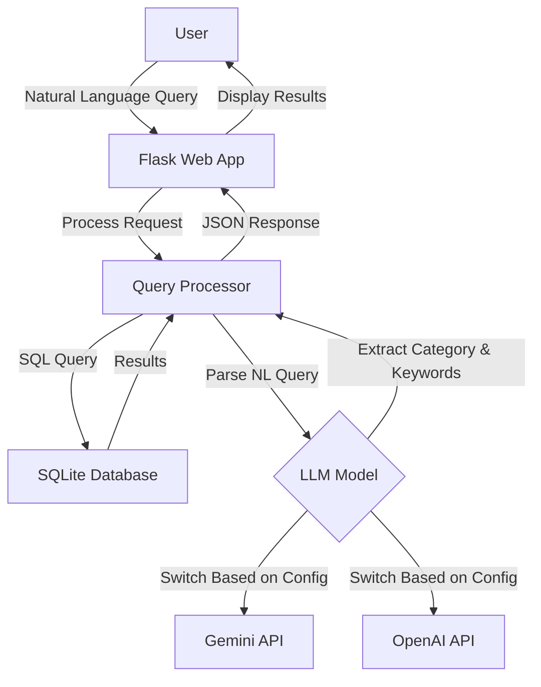

# BBC News Natural Language Query API

A lightweight natural language news query tool that combines a BBC news corpus with AI models (Google Gemini or OpenAI ChatGPT) to enable semantic search through news articles.

## Key Features

- 📰 Access BBC News article data using SQLite database
- 🔍 Efficient query caching mechanism to improve query speed
- 💬 Support for natural language query processing (using Gemini AI model)
- 🗄️ Concise, modular code structure
- 🚀 Lightweight design, easy to extend
- 🌐 Provides web interface for intuitive querying

## Dataset Information

This project uses the BBC News Dataset, which includes news articles in five main categories:
- **business**: Business news
- **entertainment**: Entertainment news
- **politics**: Political news
- **sport**: Sports news
- **tech**: Technology news

Data source: `https://huggingface.co/datasets/hf-internal/bbc-text/resolve/main/bbc-text.csv`

## 🔍 Quick Demo – Keyword‑Only Version (Baseline before LangChain)

The current implementation shows how far we can go **without** multi‑step
retrieval or an agent.  
It does exactly one thing:

1. **LLM extracts one keyword** from the user's natural‑language query  
2. **SQL `LIKE`** searches the BBC News corpus for that keyword  
3. Returns the first 10 matches, showing each article's *category* tag and
   the first few characters of its content

### How to run

```bash
# one‑time: convert CSV to SQLite  (skip if already done)
python scripts/csv_to_sqlite.py

# launch server
python app.py
```

Open http://localhost:5000, type a query, press Send.

#### Example queries

| Input | LLM‑extracted keyword  |
|-------|----------------------|
| Show me sports articles about football | football |
| tech news about Apple | apple |
| articles about foods | food (plural → singular) |
| latest news | (no keyword) → shows latest 10 articles |

When no article contains the keyword, you'll see:
⚠️ No news found.

## Project Structure

```
bbc-news-api/
├── app.py              # Flask application entry point
├── db.py               # Database connection and query handling
├── gemini_model.py     # Google Gemini API integration
├── chatgpt_model.py    # OpenAI ChatGPT integration
├── requirements.txt    # Project dependencies
├── .env                # Environment variables (API keys)
├── template.env        # Template for environment variables
├── README.md           # English documentation
├── README_ZH.md        # Chinese documentation
│
├── scripts/            
│   └── csv_to_sqlite.py  # Converts CSV dataset to SQLite
│
├── static/            
│   └── js/
│       └── main.js      # Frontend JavaScript
│
├── templates/         
│   └── index.html      # Main web interface
│
└── data/              
    ├── bbc-news.csv    # Original CSV dataset
    └── bbc_news.sqlite # SQLite database
```

## System Architecture



## Setup and Running

### Prerequisites
- Python 3.8+
- API key for Google Gemini or OpenAI (depending on which LLM you want to use)

### Installation

1. Clone the repository:
   ```bash
   git clone https://github.com/yourusername/bbc-news-api.git
   cd bbc-news-api
   ```

2. Create and activate a virtual environment:
   ```bash
   python -m venv venv
   source venv/bin/activate  # On Windows: venv\Scripts\activate
   ```

3. Install dependencies:
   ```bash
   pip install -r requirements.txt
   ```

4. Set up environment variables:
   ```bash
   cp template.env .env
   # Edit .env and add your API key(s)
   ```

5. Prepare the data:
   ```bash
   # Ensure bbc-news.csv is in the data/ folder
   python scripts/csv_to_sqlite.py
   ```

6. Run the application:
   ```bash
   python app.py
   ```

The application will be available at http://localhost:5000

## API Endpoints

### `/query` (POST)
Process a natural language query using the configured LLM.

**Request:**
```json
{
  "query": "Show me tech news about Apple"
}
```

**Response:**
```json
{
  "query": "Show me tech news about Apple",
  "parsed": {
    "category": "tech",
    "keyword": "Apple"
  },
  "results": [
    {
      "category": "tech",
      "text": "...[article content]..."
    },
    ...
  ]
}
```

### `/news` (GET)
Retrieve news articles with optional filtering.

**Parameters:**
- `category`: Filter by news category (business, entertainment, politics, sport, tech)
- `keyword`: Filter by keyword in text
- `page`: Page number (default: 1)
- `limit`: Results per page (default: 20)

**Response:**
```json
{
  "page": 1,
  "limit": 20,
  "total_pages": 10,
  "total": 200,
  "data": [
    {
      "category": "tech",
      "text": "...[article content]..."
    },
    ...
  ]
}
```

### `/search` (GET)
Simple keyword search in the news database.

**Parameters:**
- `q`: Search query
- `page`: Page number (default: 1)
- `limit`: Results per page (default: 20)

**Response:**
Same format as `/news` endpoint

### `/system_status` (GET)
Check system status and database availability.

**Response:**
```json
{
  "db_exists": true,
  "time": 1618123456.789
}
```

## LLM Integration

The application can be configured to use either Google's Gemini or OpenAI's models by setting the `AI_MODEL_TYPE` environment variable in the `.env` file:

```
AI_MODEL_TYPE=GEMINI  # or OPENAI
GEMINI_API_KEY=your_api_key_here
```

## Example Queries

- "Find tech news about mobile phones"
- "Show me sports articles about football"
- "What entertainment news mentions movies?"
- "Find business news from 2021"
- "Show me political news about elections"


你將在 Minion Assistant UI（被 TerraDesktop 以 iframe 載入）實作 token 續期的新機制。不要依賴父端程式碼細節；只需遵守下列「事件協議」與「行為要求」。

事件協議（請用這些固定字串）

Parent → Child

{"type":"auth:token","token":"<string>","exp":<optional unix-seconds>}

{"type":"ui:theme","theme":"dark"|"light"}

{"type":"auth:error","code":"...","message":"..."}

Child → Parent

{"type":"token:request","reason":"startup"|"proactive"|"401"}

Child 必須嚴格驗證 event.origin 是 Terra 的網域（用專案設定值）。Parent 的 targetOrigin 也會是該網域。

你要完成的事情

移除從 URL 讀取 token 的行為

任何 window.location.search 的 token 讀取與依賴全部移除。

其他 UI 參數（例如 themeIdxCode、userName、geospatialViewer）保留，與認證無關。

建立可更新的 token 儲存與訂閱機制

做一個極簡 tokenStore（記憶體內）：getToken()、setToken(t)、subscribe(listener)。

任何需要 token 的地方（API、WebSocket、授權狀態）都轉為從 tokenStore 讀或訂閱。

初始化 postMessage 橋接

在應用啟動時註冊 window.addEventListener("message", ...)。

收到 {"type":"auth:token"} 即 tokenStore.setToken(token)；若 3 秒內沒收到，主動送 {"type":"token:request","reason":"startup"} 給父頁。

收到 {"type":"ui:theme"} 立即切換主題（不重載頁面）。

對所有訊息檢查 event.origin；不符直接忽略。

可選：若收到 {"type":"auth:error"}，以非阻斷式提示在 UI 顯示。

API 客戶端支援「每次請求都帶最新 token」

若用 fetch：包一層 apiFetch(url, init)，在呼叫前從 tokenStore.getToken() 設 Authorization header。

若用 axios：使用單例，並在 tokenStore.subscribe 時更新 defaults.headers.Authorization。

加入 401 攔截：當出現 401/440 這類認證錯誤時，先向父頁送 {"type":"token:request","reason":"401"}，等待短暫時間（例如 2–3 秒）後自動重試一次。

WebSocket（聊天核心）支援「動態換憑證」或「平滑重連」

如果現有核心服務（如 GptCoreService）已經有 updateAuth(token) 之類 API，則在 tokenStore.subscribe 時呼叫它即可。

若沒有，請實作「平滑重連」：

監聽 tokenStore；當 token 改變時，先以新 token 建立新 WS 連線，新線開通後再關閉舊線，避免對話中斷。

連線切換期間，避免漏訊：可以暫存待送訊息或短暫雙寫（按你們協議最易行的做法）。

授權狀態切換

以 tokenStore 是否有 token 控制 isAuthorized 顯示與 UI；

如果專案歷史需要，可在 setToken 時同步寫入 sessionStorage.currentUser = {access_token}，但以 tokenStore 為主來源。

主動續期（可選但推薦）

如果你能解析 exp：在 Child 端可額外排程「快到期前 5 分鐘」送 {"type":"token:request","reason":"proactive"}，讓父頁提前推新 token。

若不解析 exp，也沒關係──Parent 端已做固定巡檢與喚醒推送。

安全與行為要求

不得在 URL、HTML 屬性或可被記錄的地方夾帶 token。

僅驗證通過的 event.origin 訊息才處理。

token 儲存於記憶體或 sessionStorage（如真有相容需求）；避免 localStorage。

不得把 token 打進應用 log；如需 debug，僅打印是否存在與 exp 時距，避免暴露值。

驗收標準

即時換憑證：不重載 iframe 的情況下，父頁推來新 token 後，API/WS 隨即改用新 token，對話不中斷（最多瞬間重連）。

長時間閒置可恢復：把頁面放超過原 token 壽命後回來，Child 端能在父端推送或自己 token:request 後恢復聊天。

401 自救：模擬 401，Child 端會向父端請新 token，並在短時間內自動重試一次成功。

主題同步：父端切 dark/light，子頁立即切換，不重載。

安全：網址與網路紀錄中不出現 token；event.origin 驗證正確；未授權情境下顯示友善提示。

文件：在專案 README 或對應 docs 補充一節「Token Renewal via postMessage」，描述事件協議與 Child 端行為。
