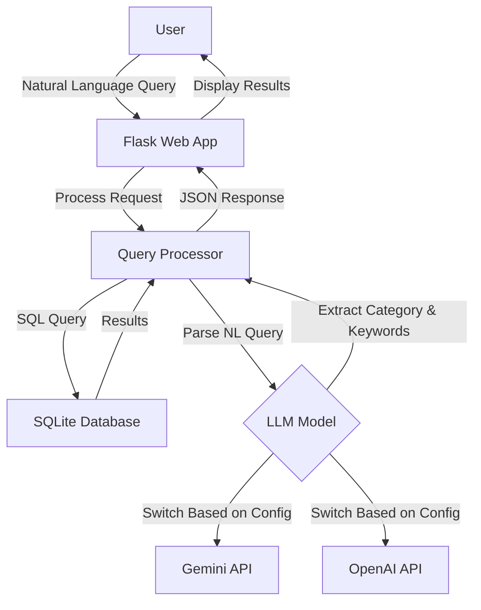

# BBC News Natural Language Query API

A lightweight natural language news query tool that combines a BBC news corpus with AI models (Google Gemini or OpenAI ChatGPT) to enable semantic search through news articles.

## Key Features

- 📰 Access BBC News article data using SQLite database
- 🔍 Efficient query caching mechanism to improve query speed
- 💬 Support for natural language query processing (using Gemini AI model)
- 🗄️ Concise, modular code structure
- 🚀 Lightweight design, easy to extend
- 🌐 Provides web interface for intuitive querying

## Dataset Information

This project uses the BBC News Dataset, which includes news articles in five main categories:
- **business**: Business news
- **entertainment**: Entertainment news
- **politics**: Political news
- **sport**: Sports news
- **tech**: Technology news

Data source: `https://huggingface.co/datasets/hf-internal/bbc-text/resolve/main/bbc-text.csv`

## 🔍 Quick Demo – Keyword‑Only Version (Baseline before LangChain)

The current implementation shows how far we can go **without** multi‑step
retrieval or an agent.  
It does exactly one thing:

1. **LLM extracts one keyword** from the user's natural‑language query  
2. **SQL `LIKE`** searches the BBC News corpus for that keyword  
3. Returns the first 10 matches, showing each article's *category* tag and
   the first few characters of its content

### How to run

```bash
# one‑time: convert CSV to SQLite  (skip if already done)
python scripts/csv_to_sqlite.py

# launch server
python app.py
```

Open http://localhost:5000, type a query, press Send.

#### Example queries

| Input | LLM‑extracted keyword  |
|-------|----------------------|
| Show me sports articles about football | football |
| tech news about Apple | apple |
| articles about foods | food (plural → singular) |
| latest news | (no keyword) → shows latest 10 articles |

When no article contains the keyword, you'll see:
⚠️ No news found.

## Project Structure

```
bbc-news-api/
├── app.py              # Flask application entry point
├── db.py               # Database connection and query handling
├── gemini_model.py     # Google Gemini API integration
├── chatgpt_model.py    # OpenAI ChatGPT integration
├── requirements.txt    # Project dependencies
├── .env                # Environment variables (API keys)
├── template.env        # Template for environment variables
├── README.md           # English documentation
├── README_ZH.md        # Chinese documentation
│
├── scripts/            
│   └── csv_to_sqlite.py  # Converts CSV dataset to SQLite
│
├── static/            
│   └── js/
│       └── main.js      # Frontend JavaScript
│
├── templates/         
│   └── index.html      # Main web interface
│
└── data/              
    ├── bbc-news.csv    # Original CSV dataset
    └── bbc_news.sqlite # SQLite database
```

## System Architecture



## Setup and Running

### Prerequisites
- Python 3.8+
- API key for Google Gemini or OpenAI (depending on which LLM you want to use)

### Installation

1. Clone the repository:
   ```bash
   git clone https://github.com/yourusername/bbc-news-api.git
   cd bbc-news-api
   ```

2. Create and activate a virtual environment:
   ```bash
   python -m venv venv
   source venv/bin/activate  # On Windows: venv\Scripts\activate
   ```

3. Install dependencies:
   ```bash
   pip install -r requirements.txt
   ```

4. Set up environment variables:
   ```bash
   cp template.env .env
   # Edit .env and add your API key(s)
   ```

5. Prepare the data:
   ```bash
   # Ensure bbc-news.csv is in the data/ folder
   python scripts/csv_to_sqlite.py
   ```

6. Run the application:
   ```bash
   python app.py
   ```

The application will be available at http://localhost:5000

## API Endpoints

### `/query` (POST)
Process a natural language query using the configured LLM.

**Request:**
```json
{
  "query": "Show me tech news about Apple"
}
```

**Response:**
```json
{
  "query": "Show me tech news about Apple",
  "parsed": {
    "category": "tech",
    "keyword": "Apple"
  },
  "results": [
    {
      "category": "tech",
      "text": "...[article content]..."
    },
    ...
  ]
}
```

### `/news` (GET)
Retrieve news articles with optional filtering.

**Parameters:**
- `category`: Filter by news category (business, entertainment, politics, sport, tech)
- `keyword`: Filter by keyword in text
- `page`: Page number (default: 1)
- `limit`: Results per page (default: 20)

**Response:**
```json
{
  "page": 1,
  "limit": 20,
  "total_pages": 10,
  "total": 200,
  "data": [
    {
      "category": "tech",
      "text": "...[article content]..."
    },
    ...
  ]
}
```

### `/search` (GET)
Simple keyword search in the news database.

**Parameters:**
- `q`: Search query
- `page`: Page number (default: 1)
- `limit`: Results per page (default: 20)

**Response:**
Same format as `/news` endpoint

### `/system_status` (GET)
Check system status and database availability.

**Response:**
```json
{
  "db_exists": true,
  "time": 1618123456.789
}
```

## LLM Integration

The application can be configured to use either Google's Gemini or OpenAI's models by setting the `AI_MODEL_TYPE` environment variable in the `.env` file:

```
AI_MODEL_TYPE=GEMINI  # or OPENAI
GEMINI_API_KEY=your_api_key_here
```

## Example Queries

- "Find tech news about mobile phones"
- "Show me sports articles about football"
- "What entertainment news mentions movies?"
- "Find business news from 2021"
- "Show me political news about elections"


// index.tsx (Minimal patch: support postMessage token + company domain whitelist)

import { createRoot } from 'react-dom/client';
import { BrowserRouter as Router } from 'react-router-dom';
import App from './App';
import { useEffect, useState } from 'react';

/** Allowed parent page conditions: limited to https + jpmchase company domain; optionally allow localhost (for development) */
const ALLOW_PARENT_SUFFIX = '.jpmchase.net';
const ALLOW_SCHEMES = new Set(['https:']);
const ALLOW_LOCALHOST = true;

// After the first successful validation, "lock" the parent origin. Subsequent messages will only be sent to this origin.
let parentOriginRef: string | null = null;

function isAllowedParentOrigin(origin: string): boolean {
  try {
    const u = new URL(origin);
    const host = u.hostname.toLowerCase();
    const schemeOk = ALLOW_SCHEMES.has(u.protocol) || (ALLOW_LOCALHOST && host === 'localhost');
    const suffixOk =
      host === 'jpmchase.net' ||
      host.endsWith(ALLOW_PARENT_SUFFIX) ||
      (ALLOW_LOCALHOST && host === 'localhost');
    return schemeOk && suffixOk;
  } catch {
    return false;
  }
}

function requestToken(reason: 'startup' | '401' | 'proactive' = 'startup') {
  // When the parent origin is not yet locked, send the request with "*" as the target (the request itself contains no sensitive info).
  const target = parentOriginRef ?? '*';
  parent.postMessage({ type: 'token:request', reason }, target);
}

const Main = () => {
  const [isAuthorized, setIsAuthorized] = useState(false);
  const [themeIdxCode, setThemeIdxCode] = useState(1); // 1 = Dark
  const [userName, setUserName] = useState<string | null>(null);
  const [geospatialViewer, setGeospatialViewer] = useState(false);

  /** ① Retain old logic: read UI parameters from the URL; if a token exists, write it to sessionStorage */
  useEffect(() => {
    const params = new URLSearchParams(window.location.search);
    const tokenFromUrl = params.get('token');
    setThemeIdxCode(params.get('theme') === '0' ? 0 : 1); // Default to Dark
    setUserName(params.get('userName'));
    setGeospatialViewer(params.get('geospatialViewer') === 'true');

    if (tokenFromUrl) {
      sessionStorage.setItem('currentUser', JSON.stringify({ access_token: tokenFromUrl }));
      setIsAuthorized(true);
    } else {
      // If the URL doesn't contain a token, check sessionStorage to avoid an initial unauthorized state.
      const hasSession = !!sessionStorage.getItem('currentUser');
      setIsAuthorized(hasSession);
    }
  }, []); // ← Empty dependency array to run only once on mount.

  /** ② New logic: receive postMessage from the parent page and request a token on startup */
  useEffect(() => {
    function onMessage(e: MessageEvent) {
      if (!isAllowedParentOrigin(e.origin)) return;

      // Upon receiving the first valid message, lock the parent's origin for all subsequent communications.
      if (!parentOriginRef) parentOriginRef = e.origin;

      const msg = e.data;

      if (msg?.type === 'auth:token' && msg.token) {
        // Write the token to sessionStorage for compatibility with existing layers (e.g., RestApi/authProvider).
        sessionStorage.setItem('currentUser', JSON.stringify({ access_token: msg.token }));
        setIsAuthorized(true);
      }

      if (msg?.type === 'ui:theme') {
        const isDark = msg.theme === 'dark';
        setThemeIdxCode(isDark ? 1 : 0);
        // Immediately toggle the <html> class name, consistent with the approach in App.jsx.
        document.documentElement.classList.toggle('dark', isDark);
        document.documentElement.classList.toggle('Light', !isDark);
      }
    }

    window.addEventListener('message', onMessage);

    // If there's no token after 3 seconds, proactively request one from the parent page.
    const t = window.setTimeout(() => {
      const hasSession = !!sessionStorage.getItem('currentUser');
      if (!hasSession) requestToken('startup');
    }, 3000);

    return () => {
      window.removeEventListener('message', onMessage);
      clearTimeout(t);
    };
  }, []);

  return (
    <Router>
      <App
        isAuthorized={isAuthorized}
        themeIdxCode={themeIdxCode}
        userName={userName}
        geospatialViewer={geospatialViewer}
      />
    </Router>
  );
};

const container = document.getElementById('root')!;
const root = createRoot(container);
root.render(<Main />);

